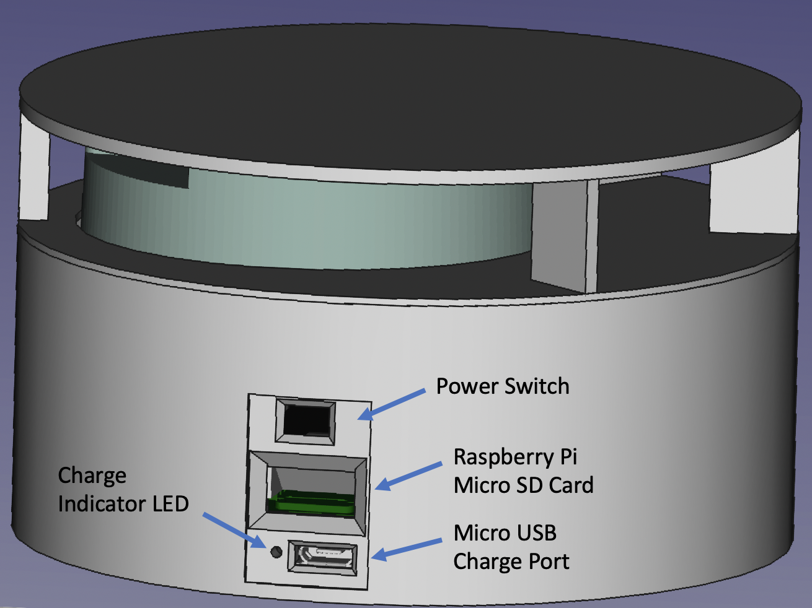

# lighthouse - LiDAR by Curio

**Buy here:** [**http://curiolighthouse.com/**](http://curiolighthouse.com/)\*\*\*\*

## Getting started with your Lighthouse device

#### First steps:

1. Fully charge your Lighthouse using a micro-usb cable.
2. After your Lighthouse is fully charged, turn it on using the switch on the side.
3. Connect your Android device to your Lighthouse.
4. Download our application from the Android Play Store and start using your Lighthouse!


If you need help with any of the steps above, head to the [Help](support/help.md) or [FAQ](support/faq.md) pages.


