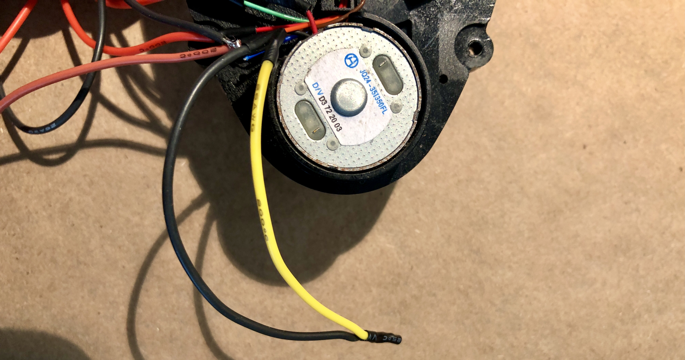
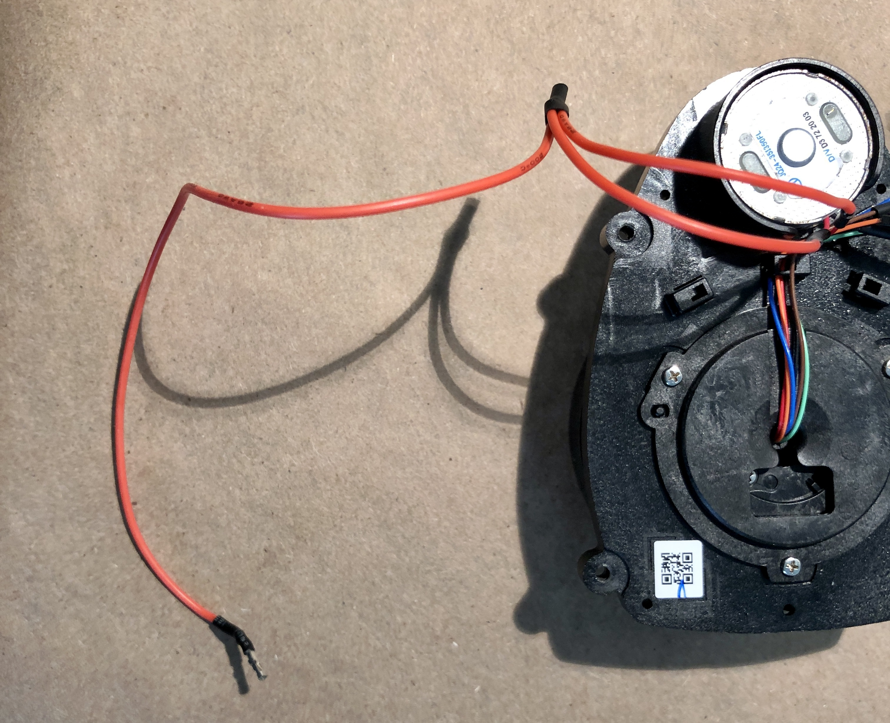
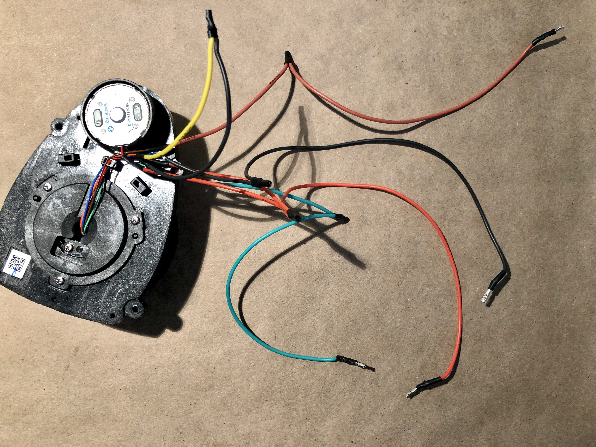
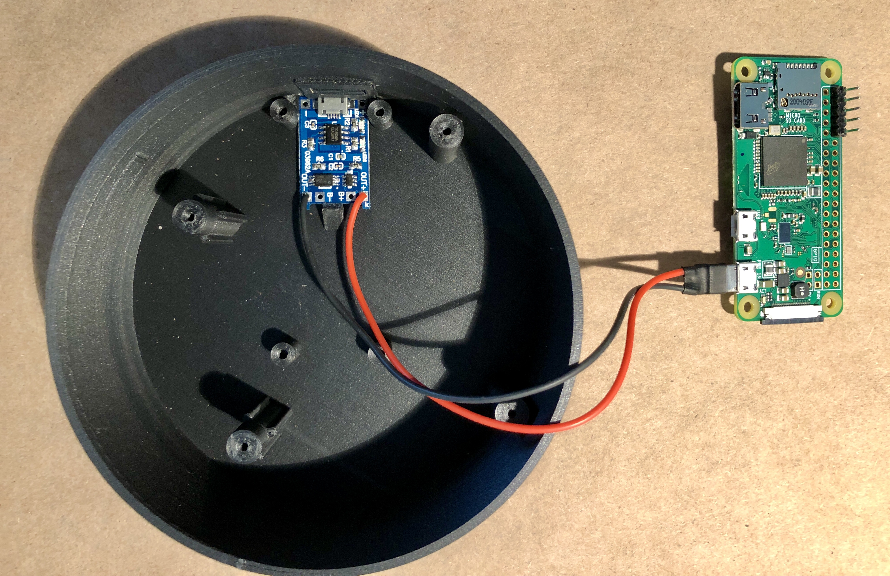
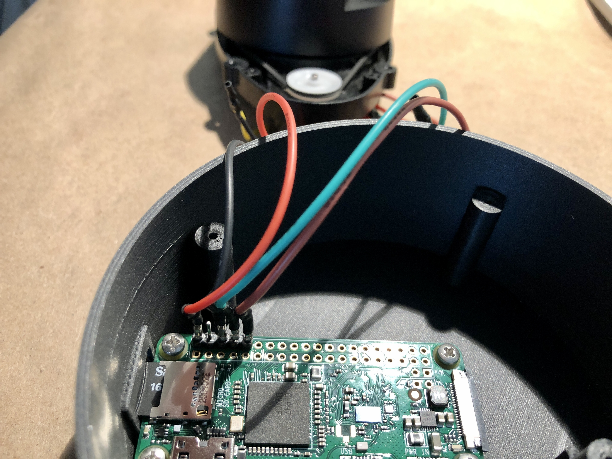
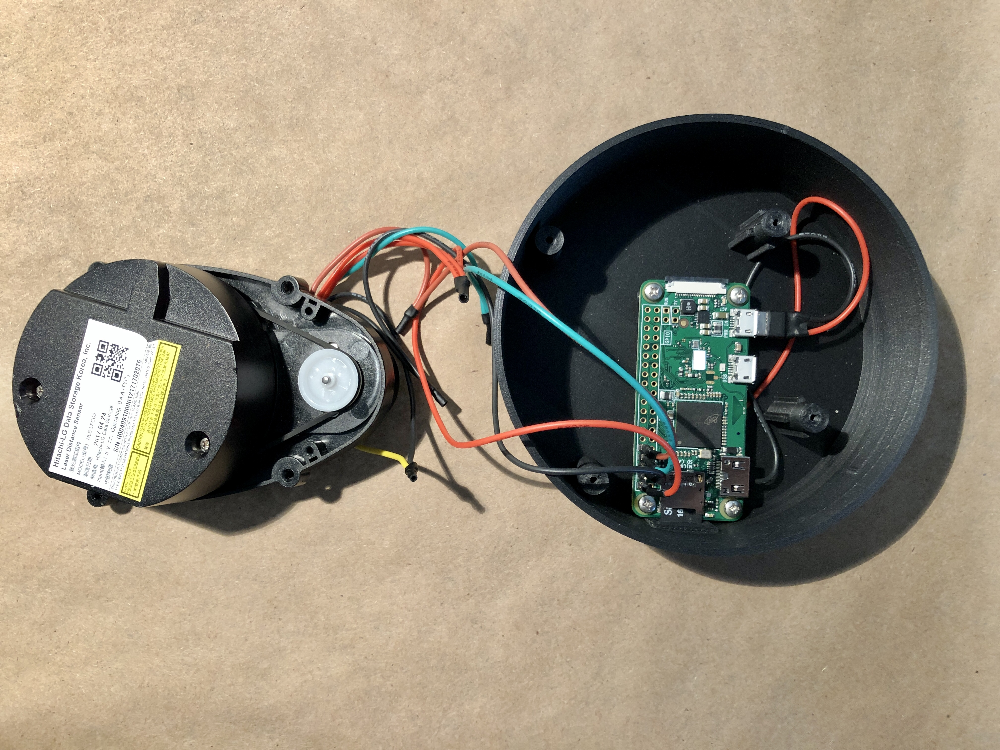
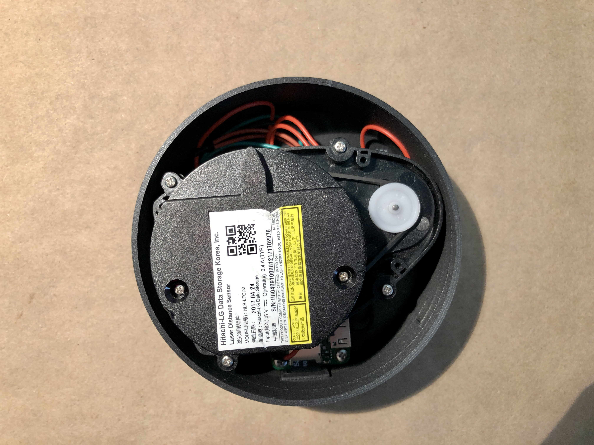

# Instructions

## The kit

You can buy the Build-Your-Own kit here: [https://curiolighthouse.wixsite.com/lighthouse/lighthouse-lidar-byo](https://curiolighthouse.wixsite.com/lighthouse/lighthouse-lidar-byo)

### What's included in the kit:

* 1 x LiDAR module
* 1 x Lighthouse carbon plastic printed body
* 1 x Micro USB power board
* 1 x Male Micro USB with lead wires
* 1 x Lighthouse carbon plastic printed top with cover
* 1 x Lighthouse carbon plastic printed open top
* 1 x 6" 26 AWG red color stranded wire
* 1 x 6" 26 AWG black color stranded wire
* 1 x 6" 26 AWG brown color female Dupont stranded wire
* 1 x 6" 26 AWG green color female Dupont stranded wire
* 1 x 6" 26 AWG red color female Dupont stranded wire
* 1 x 6" 26 AWG black color female Dupont stranded wire
* 6 x PVC shrink wrap tubing
* 4 x LiDAR module screws
* 4 x Raspberry Pi screws
* 2 x Lighthouse top screws
* 1 x Lighthouse padded box
* 1 x Lighthouse sticker

## Instructions

### Tools you will need

* Soldering iron
* Solder
* Flux
* Wire strippers \(capable of stripping 26-28 AWG stranded wire\)
* Wire cutter
* Small Philips head screw driver
* Lighter or heat gun

### Video instruction

[https://youtu.be/\_aRcoI25HqE](https://youtu.be/_aRcoI25HqE)

### Steps:

Splice the **Black** wire from the LiDAR module motor with the **Yellow/Orange** wire from the LiDAR unit.  

Splice the **Green** wire from the LiDAR module with the **Green** DuPont wire provided in the bag.

Splice the **Brown** wire from the LiDAR module with the **Brown** DuPont wire provided in the bag.

Splice the _two_ **Red** wires from the LiDAR module with the **Red** DuPont wire provided in the bag.

Splice the **Black** wire from the LiDAR module, which is NOT connected with the Yellow/Orange wire, with the **Black** DuPont wire provided in the bag

Heat shrink all of the spliced connections you've made.  Make sure to leave some extra heatshrink if you plan on soldering to your Raspberry Pi Zero W.

Solder the **Red** wire from male Micro USB plug to the **Out+** hole of the micro USB board.

Solder the **Black** DuPont wire from the male Micro USB plug to the **Out-** hole of the micro USB board.

Attach the micro USB board to the Lighthouse case by sliding towards the port hole with the board with the USB port facing away from the center of the case.  Once the board has slide forward, you can gently press down on the board to snap it in place.  



Sliding forward and snapping the micro USB board into place should not take much force.  You may need to wiggle it back and forth in order to slide it completely forward.  Using too much force could result in damage to the board or Lighthouse case.


Plug the male Micro USB plug into the **PWR** micro USB port on your Raspberry Pi Zero W

Either plug the female DuPont wires from the LiDAR module onto the header pins of the Raspberry Pi Zero W, or solder the wires to the GPIO Pins, as shown below:

Secure the Raspberry Pi Zero W to 4 short pillars in the Lighthouse case using the shortest screws provided in the bag.

Secure the LiDAR module onto the Lighthouse case by lining up the four screw holes of the LiDAR module with the taller pillars in the Lighthouse case.  Use the longest screws to attach the LiDAR module with the Lighthouse case.

Line up the electrical cover and screw it in place using the remaining two screws.


Optionally you may super glue the **top cover** onto the **electrical cover.**



🎉 You're finished!  You built your own LiDAR module!


