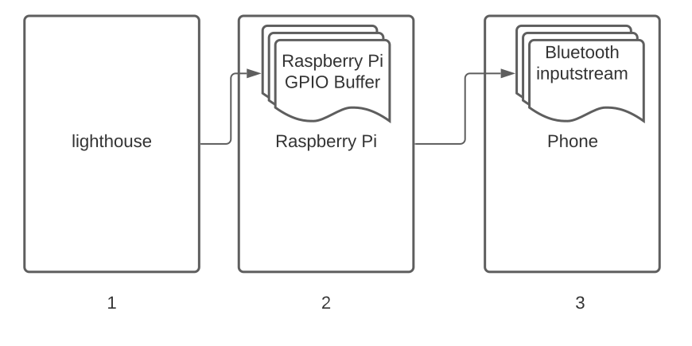

# Data Stream Architecture

There are 3 buffers through which the data coming from lighthouse travels.  

1. Data is produced from lighthouse and provided as a raw data stream.
2. Data accumulates in the GPIO input buffer on the Raspberry Pi.
   1. The GPIO input buffer is cleared, each time, before reading the configured amount of bytes \(default 1260\)
   2. The GPIO input buffer is cleared before reading new data since the lighthouse can produce data much faster \(230,400 bps\) than the Raspberry Pi can read from the GPIO buffer and send over Bluetooth.
   3. Without clearing the buffer, the data contained in the buffer would quickly grow in size resulting in an increasing delay in receiving real time data on the phone.
3. Data sent from the Raspberry Pi to the phone is captured and added to an input stream.

