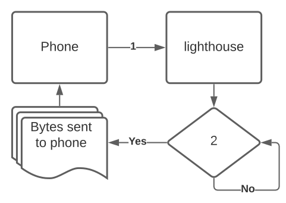

# Data Stream Architecture

## Buffers

There are 3 buffers through which the data coming from lighthouse travels.  

1. Data is produced from the LiDAR Scanner inside **lighthouse** and provided as a raw data stream.
2. Data accumulates in the GPIO input buffer on the Raspberry Pi.
   1. The GPIO input buffer is cleared, each time, before reading the configured amount of bytes \(default 1260\)
   2. The GPIO input buffer is cleared before reading new data since the LiDAR Scanner can produce data much faster \(230,400 bps\) than the Raspberry Pi can read from the GPIO buffer and send over Bluetooth.
   3. Without clearing the buffer, the data contained in the buffer would quickly grow in size resulting in an increasing delay in receiving real time data on the phone.
3. Data sent from the Raspberry Pi to the phone is captured and added to an input stream.

## Bluetooth Packets

Data from the scanner ****is captured in groups of 42 bytes which contains measurements for 6 degrees.  

1. The **lighthouse** Android library specifies the amount of bytes to capture from the LiDAR scanner ****before sending the data from the Raspberry Pi to the phone.  The packet size value is sent to the **lighthouse** when the phone executes `LIDAR.startLIDAR()`
2. **lighthouse** checks the GPIO input buffer for available data from the LiDAR scanner.  Once the GPIO buffer contains the same number of bytes and specified in the start command sent from the phone, **lighthouse** will send the data to the phone.

